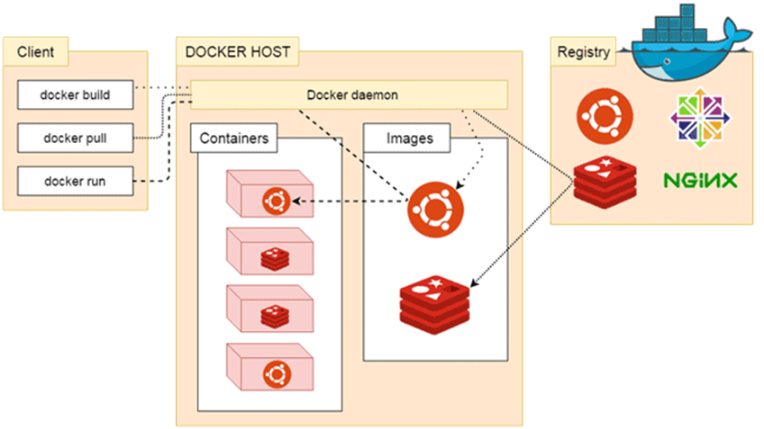

# 🐳 Day 01 - Docker Architecture & Basic Commands

---

##  What You’ll Learn

* How Docker works internally
* Key components of Docker architecture
* Basic understanding of images, containers, and registry
* Basic Docker commands

---

#  Docker Architecture (Simple View)

Docker follows a **Client-Server architecture**.


**Flow:**
User → Docker Client → Docker Daemon → Containers

👉 In simple terms:
You give a command → Docker processes it → Container runs

---

## 🔑 Core Components of Docker

---

###  1. Docker Client

* Interface to interact with Docker
* Usually CLI (`docker` command)

📌 Example:

* docker run
* docker pull
* docker ps

👉 Sends requests to Docker Daemon via REST API

---

### 2. Docker Daemon (Docker Engine)

* Core engine of Docker
* Runs in background (`dockerd`)

📌 Responsibilities:

* Build images
* Run containers
* Manage volumes & networks
* Communicate with registries

---

### 3. Docker Images

* Blueprint/template for containers
* Contains:

  * Application code
  * Libraries
  * Dependencies

📌 Important:

* Images are **read-only**
* Built using Dockerfile
* Stored in registry

---

### 4. Docker Containers

* Running instance of an image

 **Flow:**
Image → Container → Running App

📌 Features:

* Lightweight
* Fast startup
* Isolated environment
* Shares host OS kernel

---

### 5. Docker Registry

* Storage for Docker images

👉 Types:

* Public → Docker Hub
* Private → Organization registry

**Used to:**

* Push images
* Pull images

---

## Docker Workflow

1. Developer writes code
2. Build Docker image
3. Push image to registry
4. Pull image on server
5. Run container

---

## 📌 Important Concepts

---

### 🔹 Image vs Container

| Image     | Container        |
| --------- | ---------------- |
| Blueprint | Running instance |
| Read-only | Writable         |
| Static    | Dynamic          |

---

### 🔹 Lightweight Nature

* Containers don’t include full OS
* Share host kernel
* Faster and smaller than VMs

---


# Docker Commands Explained


##  1. docker version

```bash
docker version
```

### What it does:

* Displays Docker **Client and Server versions**

### 🧠 Why important:

* Confirms Docker is installed correctly
* Helps in debugging version compatibility issues


##  2. docker info

```bash
docker info
```

### ✅ What it does:

Shows detailed system-level information:

* Number of containers
* Number of images
* Storage driver
* Docker root directory
* CPU & memory details

### 🧠 Why important:

* Helps understand Docker environment
* Useful for troubleshooting

---

##  3. docker (help command)

```bash
docker
```

### ✅ What it does:

* Lists all available Docker commands

### 🧠 Why important:

* Useful when you forget commands
* Acts like a built-in help menu

---

## 4. docker search

```bash
docker search ubuntu
```

### ✅ What it does:

* Searches for images in Docker Hub

### 🧠 Output includes:

* Image name
* Description
* Stars (popularity)
* Official status

### 🧠 Why important:

* Helps you find correct and trusted images

---

## 5. docker pull

```bash
docker pull ubuntu
```

### ✅ What it does:

* Downloads an image from Docker Hub to your local system

### 📌 Important:

* Default tag = `latest`

---

### Pull Specific Version

```bash
docker pull ubuntu:22.04
```

### ✅ What it does:

* Downloads a specific version of an image

### 🧠 Why important:

* Ensures consistency across environments

---

## 6. docker images

```bash
docker images
```

### ✅ What it does:

* Lists all images stored locally

### Shows:

* Repository
* Tag
* Image ID
* Size

### 🧠 Why important:

* Helps verify downloaded images

---

## 7. docker run

```bash
docker run hello-world
```

### ✅ What it does:

* Creates and runs a container from an image

### 🔄 Behind the scenes:

1. Checks if image exists locally
2. If not → pulls from Docker Hub
3. Creates container
4. Runs it

### 🧠 Why important:

* This is the **most important Docker command**

---

## 8. docker ps

```bash
docker ps
```

### ✅ What it does:

* Lists all **running containers**

###  Shows:

* Container ID
* Image
* Status
* Ports

---

## 9. docker ps -a

```bash
docker ps -a
```

### ✅ What it does:

* Lists **all containers** (running + stopped)

### 🧠 Why important:

* Helps track container history

---

## 10. docker container ls

```bash
docker container ls
```

### ✅ What it does:

* Same as `docker ps`

---

## 11. docker container ls -a

```bash
docker container ls -a
```

### ✅ What it does:

* Same as `docker ps -a`

---

# 🌐 Docker Registry (Docker Hub)

* Central place to store images
* Public & private repositories

👉 https://hub.docker.com/

---

## 📌 Types of Images

* ✅ Official Images → Trusted & maintained
* 🔐 Verified Publisher → Trusted vendors
* 💼 Sponsored Images → Commercial support


---

# 🎯 Summary

* Docker uses Client-Server model
* Commands interact with Docker Daemon
* Images are downloaded using `docker pull`
* Containers are created using `docker run`
* `docker ps` helps monitor containers